## Introduction

You can create audio-video rooms and invite participants without even writing a line of code. You can also set role-wise permissions and change the names of these roles. This guide explains it’s steps.

## Prerequisites

- If you are new to video sdk then create account by referring [https://app.videosdk.live/signup](https://app.videosdk.live/signup) link

## Step 1 : Go to Quickstart

1. Go to [Quickstart panel](https://app.videosdk.live/quick-start) of Video SDK's website
2. Select No code SDK and click on continue.

   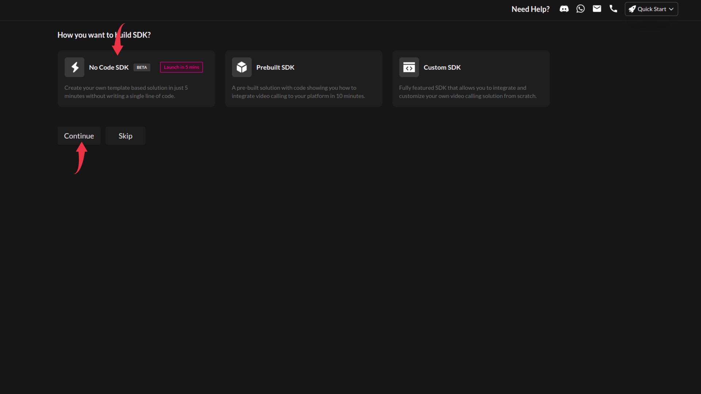

## Step 2 : Create Template

1. Add a Template name and select your nearest region specified in the region and click on continue.

   - Naming conventions for template name
     - no space is allowed
     - only - , \_ characters are allowed in addition with [a-z,A-Z,0-9]

   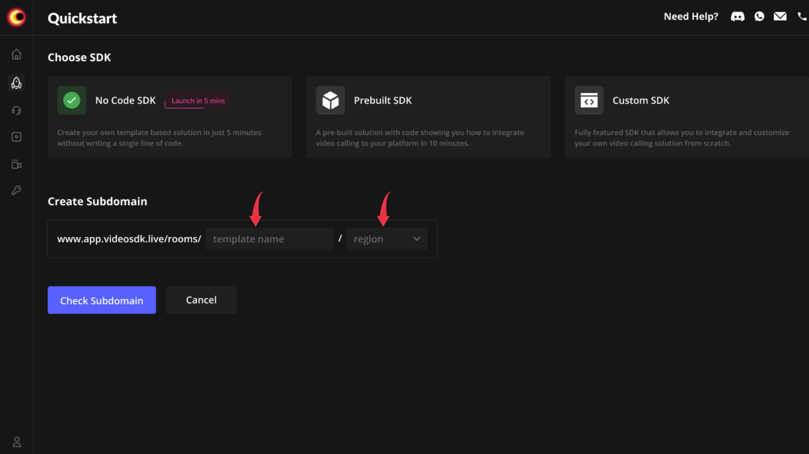

## Step 3 : Create Roles and Set Permissions

1. Let’s say you have created a template named as `Template`
2. By default 2 roles are provided and few permissions are also set, you can make changes in the permissions and even change the name of these 2 roles.
3. Moreover, you can create new roles and set permissions for that particular role.

**By clicking on **+** icon one can add as many roles as they want**

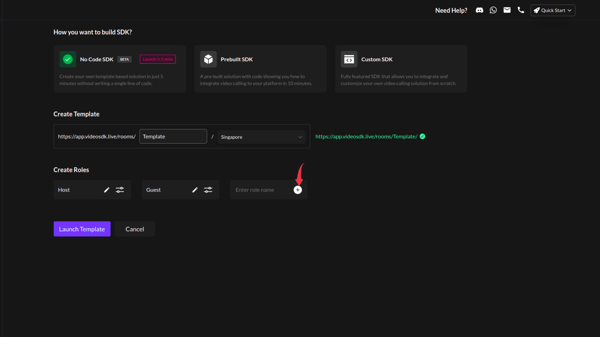

**You can edit default specified role name by clicking on an icon shown below**

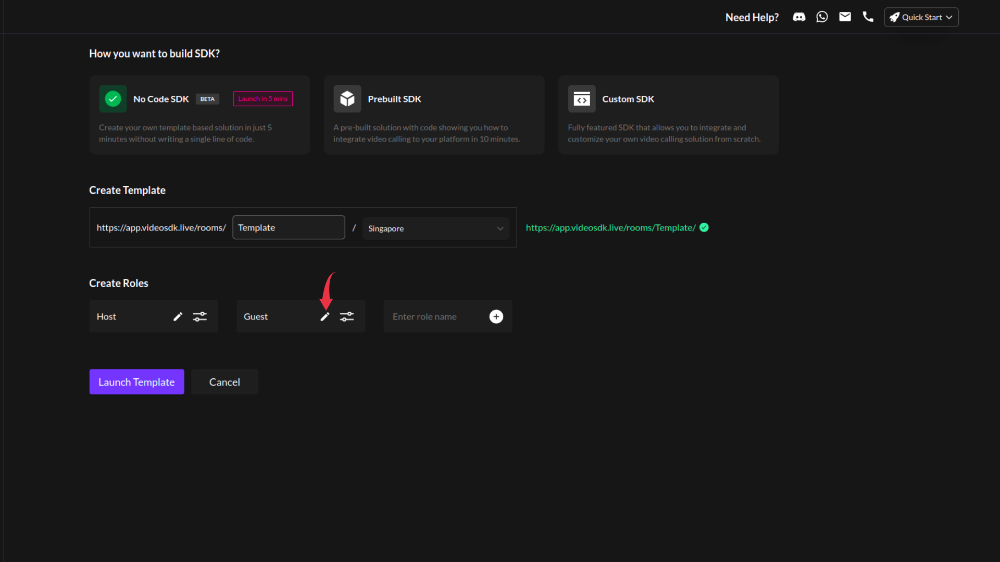

**you can edit default role’s permissions by clicking on an icon mentioned below**

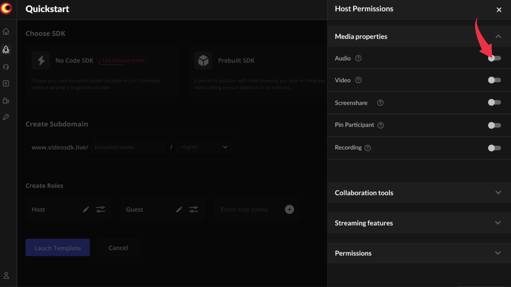

:::note
Role name should be unique for each template
:::

- By clicking on toggle button for each permission you can set those permissions either true or false.
- After setting all configurations click on the close icon which will auto save all the permissions.

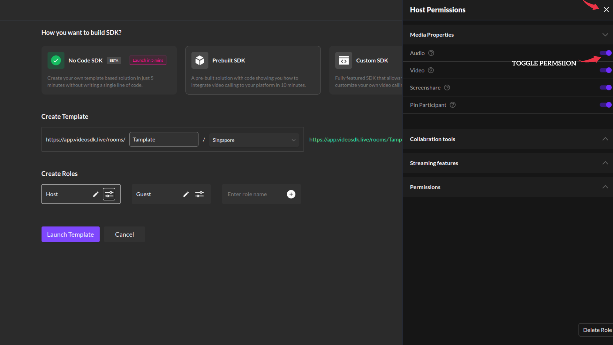

## Step 4 : Launch Template

Click on `launch template` to launch your template

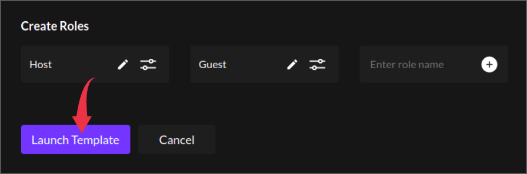

After clicking on `Launch Template` you will be redirected to a page which will contain the list of the templates created by you using `Video SDK’s no code sdk`

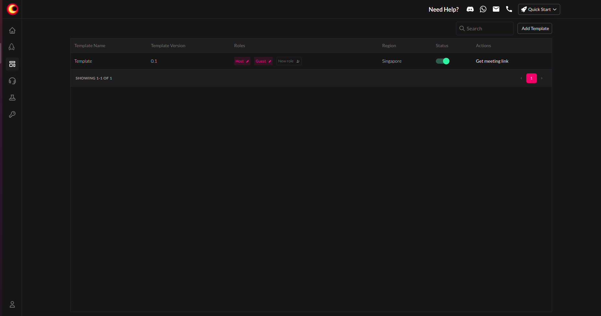

From the list you can delete role for the specific template as shown in an image below

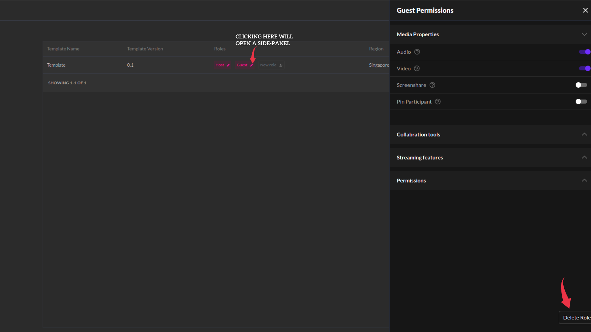

:::note
By Default, all templates are activated. You can toggle the button to deactivate a template.
:::

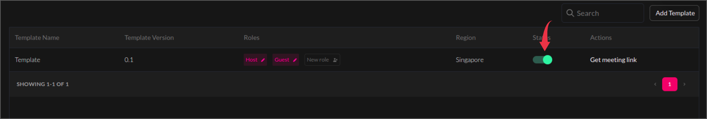

You can make changes in the role-wise permissions and also add new roles from the table.

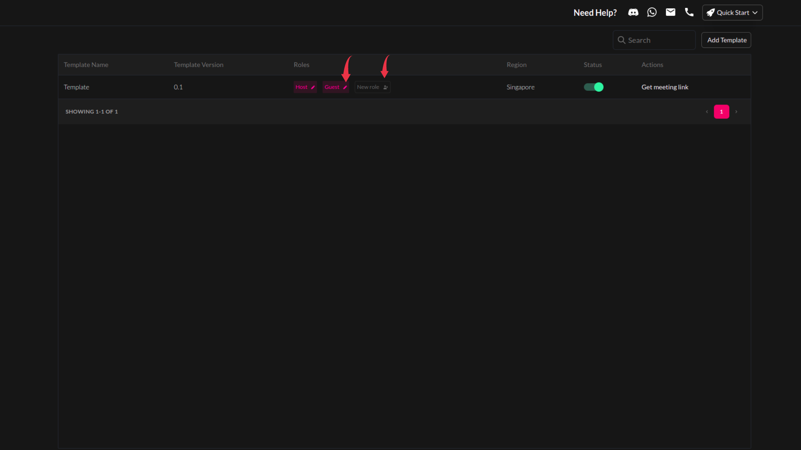

## How to start a meeting ?

**Step 1** : From the template list, click on Get meeting link to get role wise URL for a specific template. You can get links only if that template is in active status.

:::note
Each time you click on “Get meeting link”, will generate new meeting room and give it’s links. Hence, you need to save/send meeting links of each role, before closing this pop-up.
:::

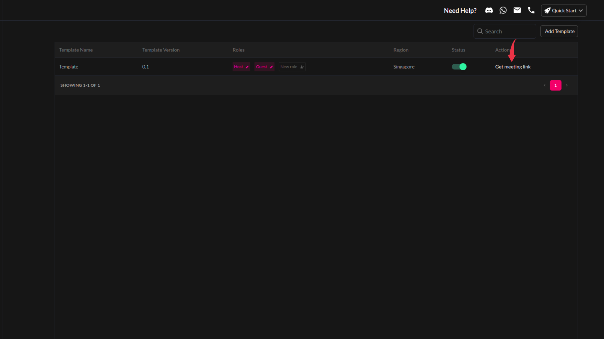

**Step 2** : Copy the link, open a new tab and paste it there.

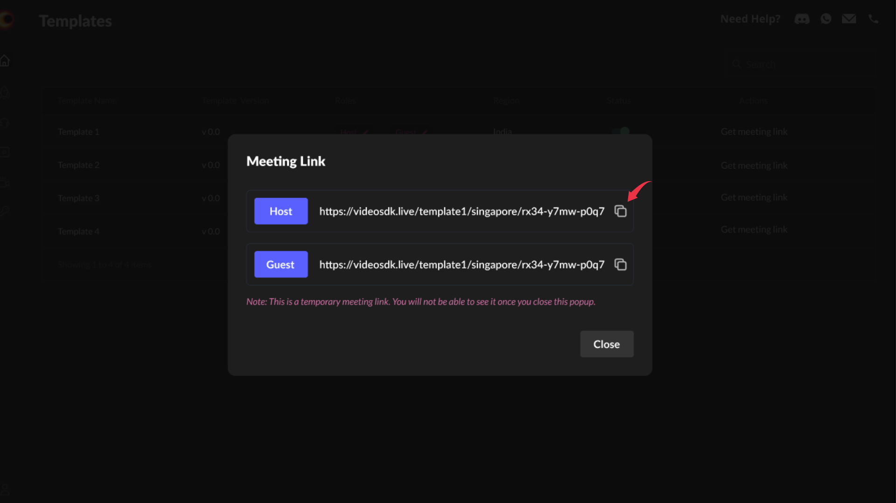

**Voila!** You have started a meeting in 5 minutes. You can copy the guest meeting link and send it to others.

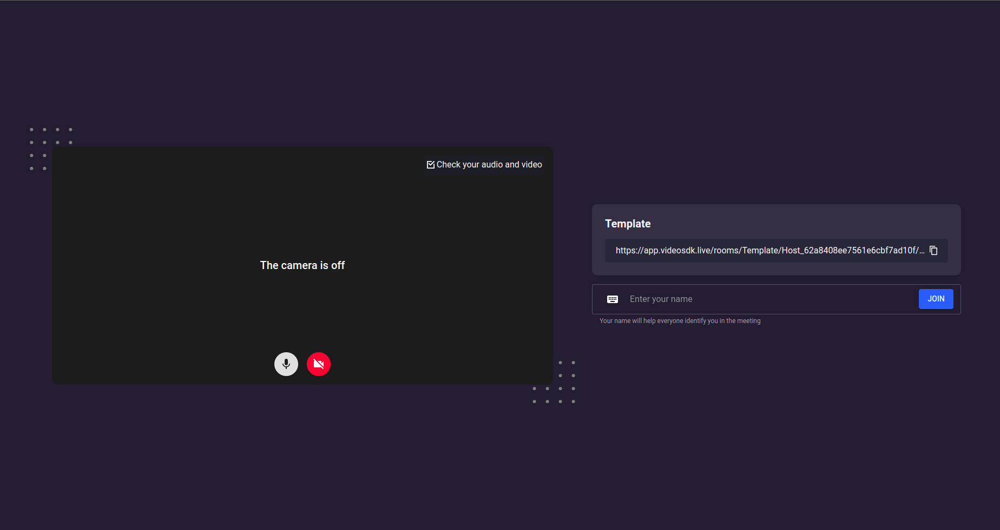

:::note
each time you make changes to permissions of a role , you’ll have to copy meeting link by clicking on get meeting link for that specific role of a template or have to refresh ongoing meeting tab in order to start a meeting with new permissions for a specific role.
:::
