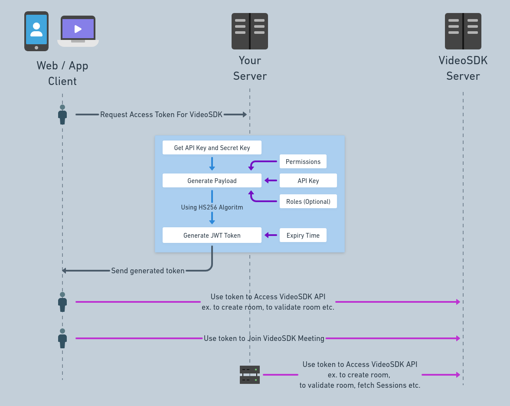
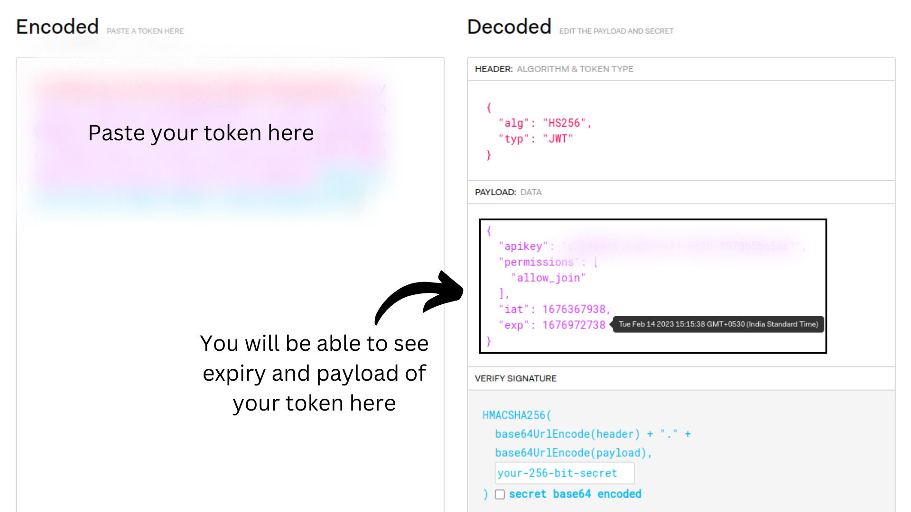

<h1> {props.title} </h1>{" "}

### Why we are using JWT based Token ?

Token based authentication allows users to verify their identity by providing generated API key and secret.

We use JWT token for the authentication purpose because Token-based authentication is **widely used** in modern web applications and APIs because it offers several benefits over traditional authentication. For example, it can **reduce the risk of the credentials being misused**, and it allows for **more fine-grained control** over access to resources. Additionally, tokens can be easily revoked or expired, making it easier to manage access rights.

### How to generate Token ?

To manage secured communication, every participant that connects to the meeting needs an access token. You can easily generate this token by using your `apiKey` and `secret-key` which you can get from [VideoSDK Dashboard](https://app.videosdk.live/api-keys).

#### 1. Generating token from Dashboard

If you are looking to do **testing or for development purpose**, you can generate a temporary token from [VideoSDK Dashboard's API section](https://app.videosdk.live/api-keys).

import ReactPlayer from "react-player";

<ReactPlayer
  autoplay
  muted
  loop
  playing
  url="/video/dashboard_token_generation.mp4"
  width={"100%"}
  controls
/>

<br />

:::tip
The best practice for getting token includes generating it from your backend server which will help in **keeping your credentials safe**.
:::

#### 2. Generating token in your backend

- Your server will generate access token using your API key and secret.
  - While generating token you can provide **expiration time, permissions and roles** which will be discussed later.
- Your client obtains token from your backend server.
- For token validation, client will pass this token to VideoSDK server.
- VideoSDK server will only allow entry in meeting if the token is valid.



import GenerateToken from "../../src/theme/GenerateTokenContainer";

<GenerateToken />

Follow our official example repositories to setup token API [videosdk-rtc-api-server-examples](https://github.com/videosdk-live/videosdk-rtc-api-server-examples)

### Payload while generating token

```js
{
 apikey: API_KEY, //MANDATORY
 permissions: [`allow_join`], //`ask_join` || `allow_mod` //MANDATORY
 version: 2, //OPTIONAL
 roomId: ROOM_ID, //OPTIONAL,
 participantId: PARTICIPANT_ID, //OPTIONAL
 roles: ['crawler', 'rtc'], //OPTIONAL
}
```

- **`apikey`(Mandatory)**: This must be the API Key generated from the VideoSDK Dashboard. You can get it from [here](https://app.videosdk.live/api-keys).

- **`permissions`(Mandatory)**: By providing the permissions, you can control what a participant can do in the meeting and whether he can join the meeting directly.

  Available permissions are:

  - **`allow_join`**: The participant is **allowed to join** the meeting directly.
  - **`ask_join`**: The participant is required to **ask for permission to join** the meeting. The participant having the permission `allow_join` can accept or reject a participant whenever someone wants to join.
  - **`allow_mod`**: The participant is **allowed to toggle** webcam & mic of other participants.

- **`version`(optional)**: For accessing the [v2 API](/api-reference/realtime-communication/intro), you need to provide `2` as the version value.

  - For passing `roomId`, `participantId` or `roles` parameters in payload, it is essential to set the version value to `2`.

- **`roomId`(optional)**: To provide customised access control, you can make the token applicable to a particular room by including the `roomId` in the payload.

- **`participantId`(optional)**: You can include the `participantId` in the payload to limit the token's access to a particular participant.

- **`roles`(optional)**:

  - **`crawler`**: This role is only for accessing [v2 API](/api-reference/realtime-communication/intro), you can not use this token for running the `Meeting`/`Room`.
  - **`rtc`**: This role is only allowed for running the `Meeting` / `Room`, you can not use [server-side APIs](/api-reference/realtime-communication/intro).

Then, you will sign this payload with your **`SECRET KEY`** and `jwt` options using the **`HS256 algorithm`**.

### Expiration time

You can set any expiration time to the token. But in the **production environment**, it is recommended to generate a token with **short expiration time** because by any chance if someone gets hold of the token, it won't be valid for a longer period of time.

### What happens if token is expired?

If your token is expired, the user won't be able to join the meeting and all the API calls will give error with message `Token is invalid or expired`.

:::note
Token is validated only once while joining the meeting, so if a person joins the meeting and token gets expired after that, there won't be any issue in the meeting.
:::

### How to check validity of token?

1. After generating the token, visit [jwt.io](https://jwt.io) and paste your token in the given area.
2. You will be able to see the payload you passed while generating the token and also be able to see the expiration time and token creation time.


