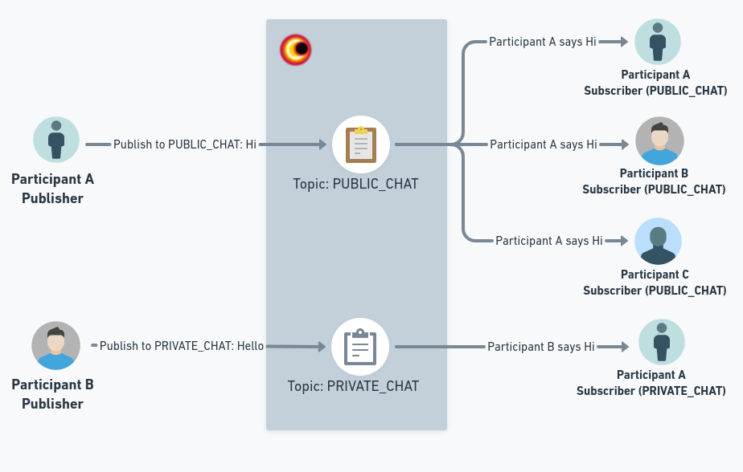

# PubSub

PubSub is a short acronym for Publish-Subscribe mechanism. These mechanism is used to send and recieve messages from a particular topic. As the name suggests, for someone to send a message, they have to specify the topic and the message which should be published and for someone to receive a message, they should be subscribed to that topic. Here is a visual to better understand publish-subscribe mechanism.



In order to use PubSub in VideoSDK, we have provided a hook `usePubSub` which allows you to subscribe to any topic and publish to any topic allowing to pass on messages and instructions during the meeting easily.

## usePubSub

### `publish()`

- This method is use for publishing message of specific topic.
- This method can be accessed from the `usePubSub` hook by mentioning the `topic` for which the `publish()` will be used.
- These method will accept two parameters as input:
  - `message`: These will be the acutal message to be published.
  - `options`: These is an object, which provides an option to specify `persist`, which persists message history for upcoming participants. When `persist` is set to `true`, the all the messages communicated will be available to download as `.csv` when the session ends.

```js
// importing usePubSub hook from react-sdk
import { usePubSub } from "@videosdk.live/react-sdk";

function MeetingView() {
  // destructure publish method from usePubSub hook
  const { publish } = usePubSub("CHAT");

  const handlePublishMessage = () => {
    // publish message
    const message = "Hello Everyone!";
    publish(message, { persist: true });
  };

  return (
    <>
      <button onClick={handlePublishMessage}>Publish Message</button>
    </>
  );
}
```

## Events associated with PubSub

### onMessageReceived

- These event callback is triggered when a new message is received on the subscribed topic.

### onOldMessagesReceived

- These event callback is triggered once when you subscribe to the topic and will will contain all the pass messages from that topic which where published with `persist` set to `true`.

```js
// importing usePubSub hook from react-sdk
import { usePubSub } from "@videosdk.live/react-sdk";

function MeetingView() {
  // destructure publish method from usePubSub hook
  const { publish } = usePubSub("CHAT", {
    //highlight-start
    onMessageReceived: (message) => {
      console.log("New Message Recieved", message);
    },
    onOldMessagesReceived: (messages) => {
      console.log("Old Message publsihed with persist:true Recieved", messages);
    },
    //highlight-end
  });

  const handlePublishMessage = () => {
    // publish message
    const message = "Hello Everyone!";
    publish(message, { persist: true });
  };

  return (
    <>
      <button onClick={handlePublishMessage}>Publish Message</button>
    </>
  );
}
```

## Getting the messages

- `messages` property of the `usePubSub` hook will hold all the past and new upcoming messages for that particular topic.

- `messages` is an array of Object containing all the messages.

These object contains following properties:

- `senderId`: These represents the `participantId` of the participant who send the message.
- `senderName`: These represents the `displayName` of the participant who send the message.
- `message`: These will be the acatual message that was send.
- `timestamp`: These wil the timestamp for when the message was published.
- `topic`: These will be the name of the topic message was published to.

## Example

```js
// importing usePubSub hook from react-sdk
import { usePubSub } from "@videosdk.live/react-sdk";

function ChatView() {
  // destructure publish method and messages from usePubSub hook
  //highlight-next-line
  const { publish, messages } = usePubSub("CHAT");

  const handlePublishMessage = () => {
    // publish message
    const message = "Hello Everyone!";
    //highlight-next-line
    publish(message, { persist: true });
  };

  return (
    <>
      <button onClick={handlePublishMessage}>Publish Message</button>
      <p>Messages: </p>
      //highlight-start
      {messages.map((message) => {
        return (
          <p>
            {messsage.senderName} says {message.message}
          </p>
        );
      })}
      //highlight-end
    </>
  );
}
```

## Applications of usePubSub

PubSub is a very powerful mechanism which can be used to do alot of things which can make your meeting experience much more interactive. Some of the most common usecase that we have come across for the PubSub during a meeting are listed below:

1. `Chat`: You can utilise this to develop various Chat features, such as Private Chat and Group Chat.
2. `Raise Hand`: You can allow attendees to raise their hands at any time during the meeting, informing everyone else that someone has done so.
3. `Layout Switching`: You can change the meeting's layout for every participant at once during the meeting, such as from Grid layout to Spotlight or Grid Layout to Sidebar Layout, etc.
4. `Whiteboard`: You can develop an interactive whiteboard functionality that is completely functional.
5. `Poll`: You may make polls, let users respond to them, and display the results at the end of a poll.
6. `Question Answer Session`: You can also design interactive functionality that is question-and-answer based.

## Downloading PubSub Messages

All the messages from the PubSub which where published with `persists` flag set to `true` can be downloaded as an `.csv` file. These file will be available in the VideoSDK dashboard as well as throught the [Sessions API](/api-reference/realtime-communication/fetch-session-using-sessionid).
