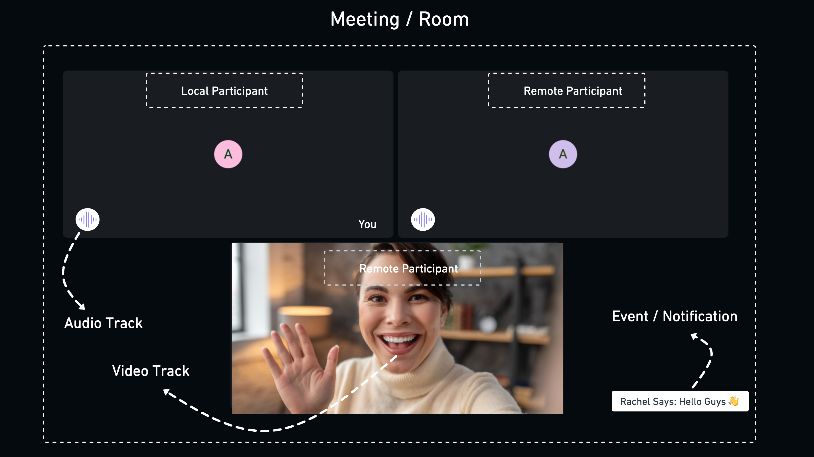
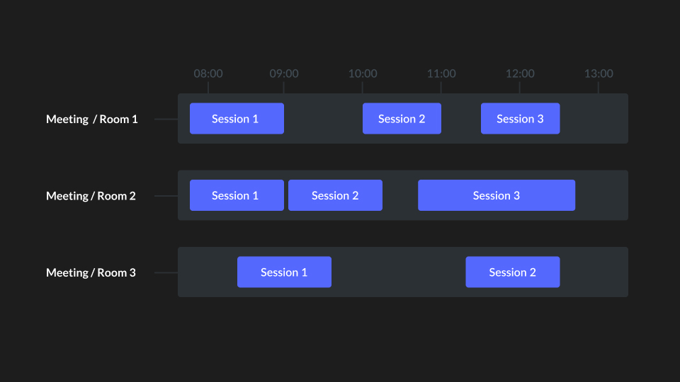
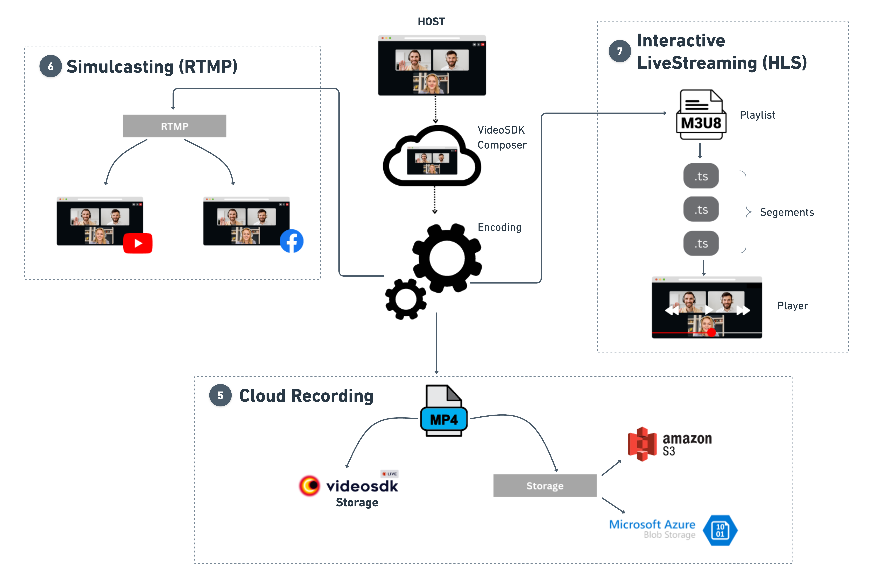

# Concept and Architecture - React

Before diving into the concept, it's essential to understand the VideoSDK. VideoSDK is a software development kit that offers tools and APIs for creating apps that are based on video and audio. It typically includes features such as video and audio calls, chat, cloud recording, simulcasting (RTMP), interactive live streaming (HLS), and many more across a wide range of platforms and devices.

## Concepts

### `1. Meeting / Room`

- Meeting or Room object in the VideoSDK provides a virtual place for participants to interact and engage in real-time voice, video, and screen-sharing sessions. The object is in charge of handling media streams and participant communication.

- Meeting or Room can be uniquely identified by `meetingId` or `roomId`.

### `2. Participant`

- Participant is a VideoSDK object that represents each user/client in the meeting or room and allows them to share audio/video assets.

- `2.1 Local Participant` :
  The local participant is the one that runs on the user's device. The local participant has control over their own media streams, including the ability to start and stop audio and video.

  - The local participant in a meeting/room can also connect with other participants by transmitting and receiving audio and video streams, exchanging chat messages, and more.

- `2.2 Remote Participant` :
  The remote participant receives audio and video streams from both the local participant and other remote participants. Additionally, they have the ability to exchange audio, video, and chat messages with the local participant.

- Each participant in VideoSDK can be uniquely identified by `participantId`.

### `3. MediaStream & Track`

- A mediastream is a collection of audio & video tracks that can be transmitted between participants in real-time.

- A track is a continuous flow of audio or video data and can be thought of as a stream of media frames.

- A mediastream can contain multiple tracks. One video track for the video feed from the camera and one audio track for the audio feed from the microphone. These tracks can be transmitted between participants in VideoSDK Meeting / Room.

### `4. Events / Notifications`

- Events / Notifications can be used to inform users about various activities happening in a Meeting / Room, including participant join/leave and new messages. They can also be used to alert users about any SDK-level errors that occur during a call.

### `5. Session`

- A Session is the instance of an ongoing meeting/room which has one or more participants in it. A single room or meeting can have multiple sessions.
- Each session can be uniquely identified by `sessionId`.

---

### `6. Cloud Recording`

- Cloud recording in VideoSDK refers to the process of recording audio or video content and storing it on a remote server or VideoSDK server.

### `7. Simulcasting (RTMP)`

- RTMP is a popular protocol for live streaming video content from the VideoSDK to platforms such as YouTube, Twitch, Facebook, and others.
- By providing the platform-specific `stream key` and `stream URL`, the VideoSDK can connect to the platform's RTMP server and transmit the live video stream.

### `8. Interactive Live Streaming (HLS)`

- Interactive live streaming (HLS) refers to a type of live streaming where viewers can actively engage with the content being streamed and with other viewers in real-time.

- In an interactive live stream (HLS), viewers can participate in various activities, such as live polling, Q&A sessions, and even sending virtual gifts to the content creator or each other.

## Architecture

This diagram illustrates the comprehensive flow for implementing video and audio calls, recording calls, and broadcasting live on social media platforms.

