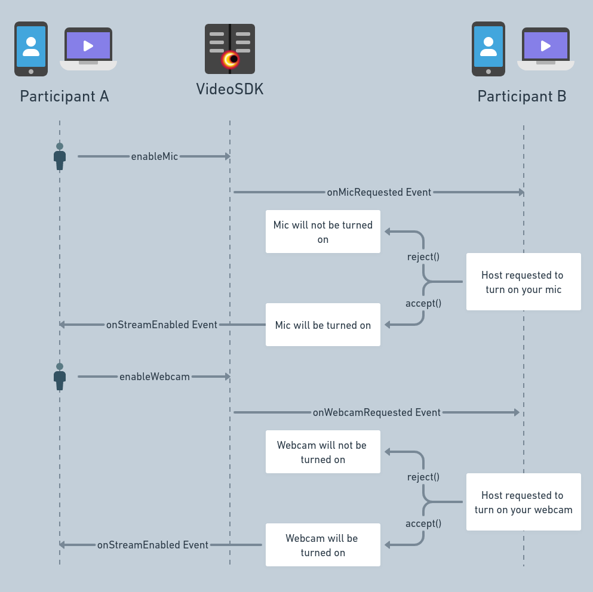

# Toggle Remote Participant Media - React

When hosting a meeting, it's essential for the host to have the capability to request that someone's microphone or camera be turned on, or to turn them off as needed. This guide focuses on this very aspect of controlling other participant's media.

:::note
The Participant with the capability to control other participant's media should have permission **`allow_mod`** passed in the token. To know more about permissions [**visit here**](/react/guide/video-and-audio-calling-api-sdk/authentication-and-token).
:::

Before delving into the methods and events associated with this functionality, explore how the flow would unfold.



## Methods

### `enableMic()`

- If the host wishes to activate a participant's microphone, the `enableMic()` method from the `useParticipant` hook should be employed.

- Upon invoking this method, the participant whose microphone is requested for, will receive the `onMicRequested` event. This event contains the `participantId` of the host making the request, along with two callback functions—`accept` and `reject`. The participant can decide to accept or reject the incoming request.

- For instance, if a meeting involves **Participant A** and **Participant B**, and the host (**Participant A**) desires to enable the microphone of **Participant B**, the host will utilize the `enableMic()` function to send a request to **Participant B**. Subsequently, **Participant B** will receive the `onMicRequested` event and can choose to either accept or reject the incoming request.

### `enableWebcam()`

- If the host wishes to activate a participant's camera, the `enableWebcam()` method from the `useParticipant` hook should be employed.

- Upon invoking this method, the participant whose camera is requested for, will receive the `onWebcamRequested` event. This event contains the `participantId` of the host making the request, along with two callback functions—`accept` and `reject`. The participant can decide to accept or reject the incoming request.

- For instance, if a meeting involves **Participant A** and **Participant B**, and the host (**Participant A**) desires to enable the camera of **Participant B**, the host will utilize the `enableWebcam()` function to send a request to **Participant B**. Subsequently, **Participant B** will receive the `onMicRequested` event and can choose to either accept or reject the incoming request.

### `disableMic()`

- If the host wishes to deactivate a participant's microphone, the `disableMic()` method from the `useParticipant` hook should be employed.

- This will automatically disable the microphone of the participant.

### `disableWebcam()`

- If the host wishes to deactivate a participant's camera, the `disableWebcam()` method from the `useParticipant` hook should be employed.

- This will automatically disable the camera of the participant.

#### Example

```js
import { useParticipant } from "@videosdk.live/react-sdk";

const ParticipantView = () => {
  const { enableWebcam, disableWebcam, enableMic, disableMic } =
    useParticipant("<participant-id>");

  const handleEnableWebcam = () => {
    // This will emit an event called "onWebcamRequested" to that particular participant
    enableWebcam();
  };

  const handleEnableMic = () => {
    // This will emit an event called "onMicRequested" to that particular participant
    enableMic();
  };

  const handleDisableWebcam = () => {
    // This will disable the webcam of that particular participant
    disableWebcam();
  };

  const handleDisableMic = () => {
    // This will disable the mic of that particular participant
    disableMic();
  };

  return (
    <>
      <button onClick={handleEnableWebcam}>Enable Webcam</button>
      <button onClick={handleEnableMic}>Enable Mic</button>
      <button onClick={handleDisableableWebcam}>Disable Webcam</button>
      <button onClick={handleDisableableMic}>Disable Mic</button>
    </>
  );
};
```

## Events

### `onWebcamRequested`

This event is triggered for a participant (`Participant B`) when the host (`Participant A`), requests to enable their webcam. The event handler for this event will receive the following three arguments:

- `accept()` - Callback function to accept the request.
- `reject()` - Callback function to reject the request.
- `participantId` - ParticipantId of the requesting participant

### `onMicRequested`

This event is triggered for a participant (`Participant B`) when the host (`Participant A`), requests to enable their microphone. The event handler for this event will receive the following three arguments:

- `accept()` - Callback function to accept the request.
- `reject()` - Callback function to reject the request.
- `participantId` - ParticipantId of the requesting participant

###### Usage

```js
import { useMeeting } from "@videosdk.live/react-sdk";

const {
  /** Methods */
} = useMeeting({
  onWebcamRequested: ({ accept, reject, participantId }) => {
    // callback function to accept the request
    accept();

    // callback function to reject the request
    reject();
  },
  onMicRequested: ({ accept, reject, participantId }) => {
    // callback function to accept the request
    accept();

    // callback function to reject the request
    reject();
  },
});
```

import ReactPlayer from 'react-player'

<div style={{textAlign: 'center'}}>

<ReactPlayer autoplay muted loop playing url='/video/toggle-media.mp4' width={"100%"}/>

</div>

## API Reference

The API references for all the methods and events utilized in this guide are provided below.

- [enableMic()](/react/api/sdk-reference/use-participant/methods#enablemic)
- [enableWebcam()](/react/api/sdk-reference/use-participant/methods#enablewebcam)
- [onWebcamRequested()](/react/api/sdk-reference/use-meeting/events#onwebcamrequested)
- [onMicRequested()](/react/api/sdk-reference/use-meeting/events#onmicrequested)
